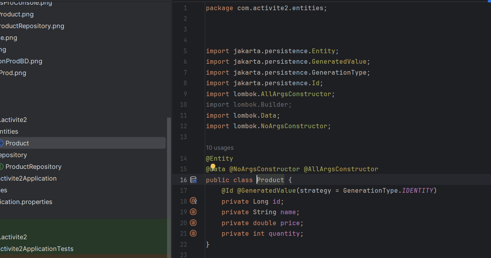
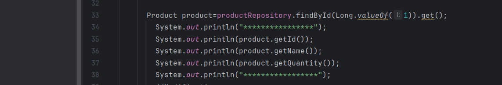

<h3>Compte Rendu PRODUIT<h3>
<h4>Entité Product</h4>

<h4>Application properties</h4>

<h4>ProductRepository</h4>

<h4>Gestion de produit</h4>
<h4>Ajouter Produit</h4>

<h5>lister</h5>

<h5>chercher</h5>

<h5>Modifier</h5>

<h5>supprimer</h5>

<h4>Base de donnée</h4>

<h4>execution</h4>

